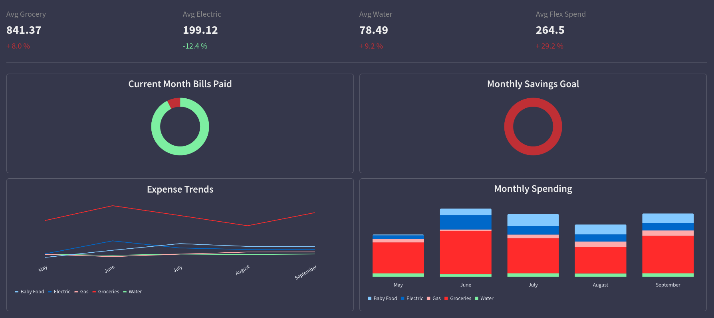

# Budget Streamlit App

## Why?
Visualization and UI constraints in source data within Google Sheets.

## Tooling 
|	Need | Platform |
|----------|----------|
| API    | [gspread](https://docs.gspread.org/en/latest/)   |
| Web Dev    | [streamlit](https://docs.streamlit.io/)   |
| ETL    | [pandas](https://pandas.pydata.org/docs/index.html)   |
| Visualization    | [vega-lite](https://vega.github.io/)   |

## ToDo
- Metric Cards
    - Negative Conditional Formatting not working
    - Remove '-' symbol for negative values

- Sidebar
    - Payment Widget for ELT

- Authentication
    - Login

