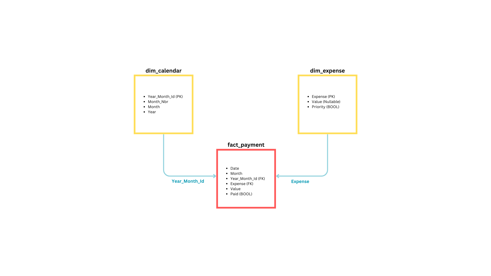

# Budget Streamlit App

## Current Version 3.0
- Major Update
    - migrated backend from Google Sheets workbook to managed PostgreSQL database.
    - Schema below.

## Tooling 
|	Need | Platform |
|----------|----------|
| Database    | [Heroku Postgres](https://devcenter.heroku.com/articles/heroku-postgresql)   |
| Web Dev    | [streamlit](https://docs.streamlit.io/)   |
| ETL    | [pandas](https://pandas.pydata.org/docs/index.html)   |
| Visualization    | [vega-lite](https://vega.github.io/)   |
| Hosting | [Heroku](https://dashboard.heroku.com) |

## ToDo
- Sidebar 
    - Current month and year should be default options in update widget.

- New Visual
    - Visual to show remaining balance from monthly income.

- Database Update
    - Create separate Flex Spend table with details for each flex spend entry linked to fact_payment.

## Completed Updates
- ~~Sidebar~~
    - ~~Improve Widget to be dict based on category~~
    - ~~Widget Data Validation~~
    - ~~Payment Widget for ELT~~

- ~~Fix Deployment~~
    - ~~config.toml does not take affect, this needs to be fixed~~

- ~~Backend Migration~~
    - ~~transition to PostgreSQL database~~

- ~~Detail Pages~~
    - ~~tabular detail views for each visual as redirects~~

- ~~Metric Cards~~
    - ~~Negative Conditional Formatting not working~~
    - ~~Remove '-' symbol for negative values~~

- ~~Authentication~~
    - ~~Login~~

